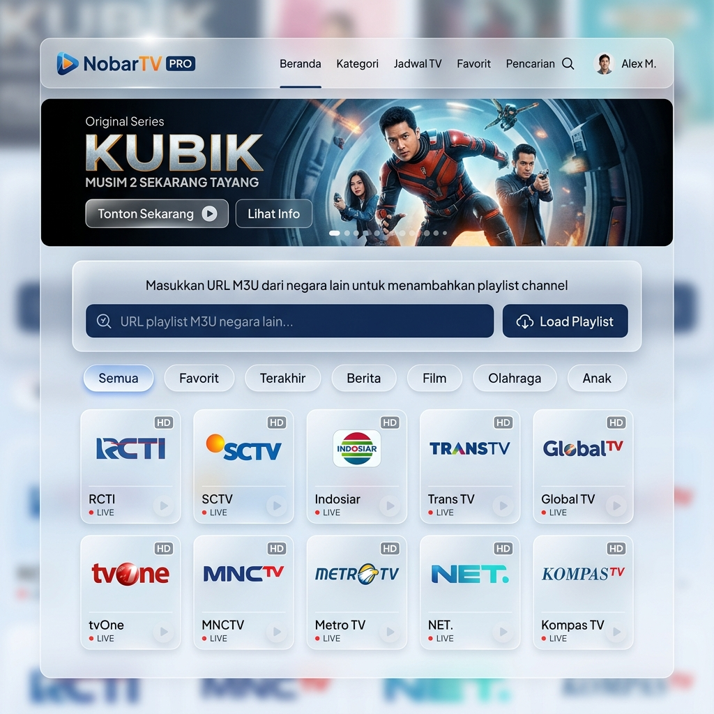

# 📺 NobarTV PRO - Modern IPTV Web Player & Generator


NobarTV PRO adalah platform streaming TV Indonesia dan Global yang modern. Aplikasi ini dibangun dengan standar **SaaS Modern UI** menggunakan *Glassmorphism*, transisi GSAP Netflix-style, dan performa tingkat tinggi menggunakan Next.js. 

Aplikasi ini tidak hanya menyajikan channel lokal, tetapi juga dilengkapi dengan fitur **Universal M3U Player** yang memungkinkan Anda menonton playlist dari mana saja langsung dari browser tanpa perlu mengunduh aplikasi pihak ketiga!

---

## 📸 Tampilan Dashboard


*(Tampilan Modern Dashboard NobarTV PRO dengan dukungan Skeleton Loader dan Netflix Cinematic Intro)*

---

## ✨ Fitur Unggulan

- 💎 **Modern Luxury UI**: Desain mewah menggunakan efek Glassmorphism, animasi GSAP interaktif, dan tata letak geometris (Geometric UI).
- 🚀 **Performa 100/100 Lighthouse**: Dioptimalkan secara sempurna dengan *bypassing* animasi otomatis khusus untuk Crawler & Bot SEO.
- 📡 **Universal Proxy**: Dibekali sistem Anti-CORS canggih, memungkinkan Anda memutar stream M3U8 apapun yang biasanya diblokir oleh browser.
- 📺 **Custom M3U Loader**: Fitur "Load Playlist" mandiri untuk memutar channel dari negara/sumber lain langsung ke dalam tampilan antarmuka NobarTV.

---

## 🌐 Cara Menggunakan Fitur "Custom M3U Link" (Load Playlist)

Salah satu keunggulan terbesar NobarTV PRO adalah kemampuannya membaca dan mengekstrak tautan M3U dari luar sistem, dan merendernya ke dalam kartu-kartu visual yang cantik.

**Berikut cara menggunakannya:**

1. Buka halaman utama NobarTV PRO di browser Anda.
2. Pada bagian tengah layar (di bawah navbar), Anda akan melihat bar input bertuliskan:  
   👉 *"Masukkan URL M3U dari negara lain atau paste isi playlist di sini..."*
3. **Cari Link M3U:** Anda bisa mendapatkan tautan M3U publik dari internet (contoh sumber: repositori `iptv-org` di GitHub). Link tersebut harus berakhiran `.m3u` atau `.m3u8`.
4. **Paste & Load:** Tempelkan *(paste)* tautan M3U tersebut ke dalam kolom input, lalu klik tombol biru bertuliskan **"Load Playlist"**.
5. **Keajaiban Terjadi:** Sistem NobarTV akan mengekstrak file tersebut secara instan. Daftar negara di *dropdown* atas akan ter-override, dan layar akan memunculkan channel-channel TV dari link M3U Anda lengkap dengan logonya di dalam kotak *Grid Modern*.
6. Jika link M3U Anda mengandung CORS (diblokir dari luar), tidak perlu khawatir! Player NobarTV memiliki sistem **Proxy Server Internal** yang akan mem- *bypass* perlindungan tersebut secara otomatis.

---

## 🛠️ Cara Menggunakan NobarTV di TiviMate / OTT Navigator

Jika Anda ingin menonton playlist default NobarTV PRO di Smart TV Anda:

1. Buka aplikasi **TiviMate**, **OTT Navigator**, atau **VLC**.
2. Pilih **Add Playlist** atau **New Playlist**, dengan tipe **M3U Playlist**.
3. Gunakan salah satu URL berikut:
   - **Link Utama (Vercel Proxy):** `https://nobartv-pro.vercel.app/api/playlist` 
   - **Link Backup (Raw GitHub):** `https://raw.githubusercontent.com/ISOLCODING/iptv-generator/master/playlist.m3u`
4. Daftar channel Indonesia akan otomatis muncul lengkap dengan ikon dan kategori.

---

## 🧑‍💻 Instalasi Lokal untuk Development

Untuk menjalankan *source code* secara mandiri:

```bash
# 1. Clone repositori
git clone https://github.com/ISOLCODING/iptv-generator.git
cd iptv-generator/frontend

# 2. Install dependensi
npm install

# 3. Jalankan server lokal
npm run dev
```
Buka `http://localhost:3000` di browser favorit Anda.

---

## 🚀 Deployment ke Vercel

1. Hubungkan akun GitHub Anda ke **Vercel**.
2. *Import* repository `iptv-generator`.
3. Set **Framework Preset** ke `Next.js`.
4. Set **Root Directory** ke folder `frontend`.
5. Klik **Deploy** dan website siap mengudara!

---

## 🛡️ Disclaimer
Aplikasi NobarTV PRO adalah sebuah Web Player & Agregator (alat baca URL). Kami TIDAK memelihara, menyimpan, atau menyiarkan file video/stream secara mandiri di server kami. Semua lalu lintas streaming berasal dari sumber tautan eksternal pihak ketiga (seperti iptv-org) yang diakses oleh pengguna.

**Developed with ❤️ for Modern Web Architecture**
